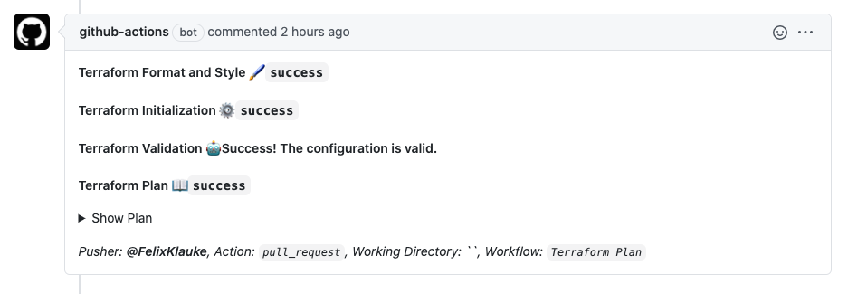

# Blog
Resources regarding Blog Articles of the Klauke Enterprises [Blog](https://blog.klauke-enterprises.com)

## GitOps with Terraform
While infrastructure is often maintained manually and decentralized the GitOps approach aims to consolidate a declarative configuration of your infrastructure
inside your project source code. This leads to Infrastructure as Code at its best: All your infrastructure is handled as Code along with your common source code.  

This enables some interesting options:
- Reviewing your infrastructure changes is as easy as creating a pull request
- The infrastructure is much closer to the developers (DevOps)
- You have a complete history of your infrastructure, its changes and its current state

### GitOps: CI/CD Pipeline with Terraform and GitHub Actions
Terraform can also be applied using a simple CI/CD Pipeline, e.g. built with GitHub Actions. I've setup a [terraform workflow](.github/workflows/terraform.yaml) that does a full terraform lifecycle with a terraform remote backend.  

After the initial configuration and the `$ terraform plan` step the full plan is posted as a comment in your pull request. At this point you can do a review with your team as terraform will precisely determine the changes that will be applied to your infrastructure in case you accept the pull request and merge is to master:

### Terraform Proxmox
It's rather simple to deploy virtual machines with terraform in proxmox. You can find the corresponding terraform file [here](terraform/proxmox). You can find a detailed description of this approach in this blog article (german):

[Proxmox mit Terraform: Infrastructure as Code leicht gemacht](https://blog.klauke-enterprises.com/proxmox-terraform-infrastructure-as-code-leicht-gemacht)

### Cloudflare Terraform
In [here](terraform/dns) is shown how to manage your dns records via terraform.
